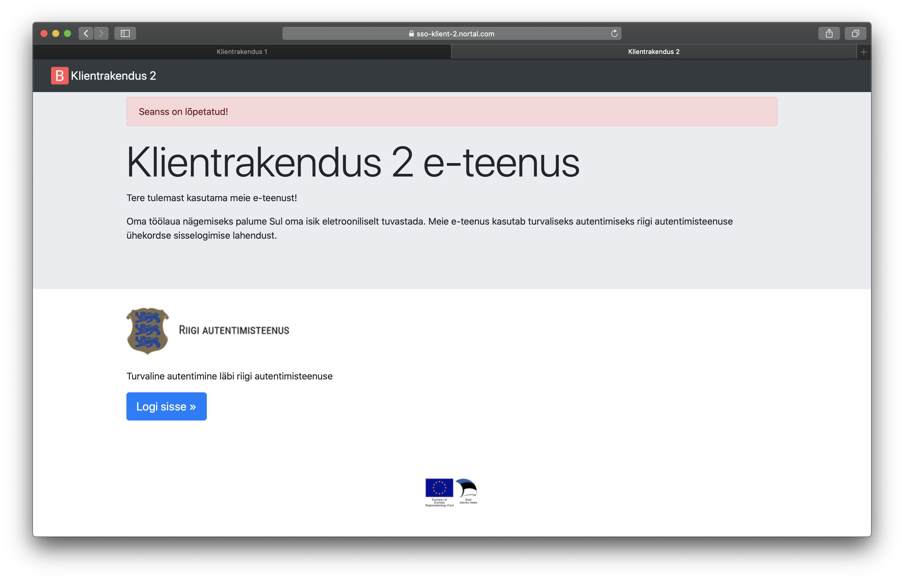

Märkus. Repo on mõeldud avalikuks kasutamiseks. Skriptidest ja dokumentatsioonist eemaldatud  RIA taristu tundlike nimede jm väärtuste mainimised. Samuti on repost eemaldatud võtmed ja serdid.

Vt ka:
- [Ühekordse sisselogimise (SSO) projektlahendus](https://e-gov.github.io/TARA-Doku/SSO%20projektlahendus)
- [Riikliku SSO tehniline spetsifikatsioon ja protokolli kirjeldus](https://e-gov.github.io/TARA-Doku/SSO%20tehniline%20spetsifikatsioon) (inglise keeles)

# TARA SSO prototüüp (proof of concept, POC)

## Eesmärk

Prototüüp on makettrakenduste kogum, mis võimaldab kasutajal läbi teha SSO kõik olulised kasutusvood. Prototüüp teostatakse vastavalt projekti tööde kirjelduse p 3.1 järgi väljatöötatud projektlahendusele ([Ühekordse sisselogimise (SSO) projektlahendus](https://e-gov.github.io/TARA-Doku/SSO%20projektlahendus)).
Prototüübi eesmärk on maandada teostatavusriski, turvariski ja kasutatavusriski.
Prototüüp ei ole mõeldud evitamiseks toodangukeskkonda.

## POC tehnilise lahenduse valik

Prototüübi realiseerimisel kasutati levinud OpenID Connect (OIDC) protokolli toega tarkvarakomponente.
Valdavalt on kasutusel Java tehnoloogiad ja Spring Boot raamistikku,  sest arendus antud platvormil on tellijale tuttav ja prototüüpimine võrdlemisi lihtne. Spring Boot on laialt levinud Java tarkvara raamistik. POC-i käigus tahtsime tõestada Spring Security (Spring raamistiku turvatäienduste paketi) sobivust standardse OIDC klientrakenduse implementeerimiseks.
TARA SSO taustasüsteemi tuumikuna otsustati katsetada Go keeles kirjutatud ORY Hydra platvormi.
Prototüübi Hydra serveri vahelehtede disainis on kasutatud TARA teenuse kasutajaliidese komponente, mis põhinevad Veera raamistikul. Klientrakenduse disainis on kasutatud Bootstrap disainiraamistikku.

### ORY Hydra valik

ORY Hydra näol on tegemist vabavaralise Oauth 2.0 ja OIDC protokolli implementeeriva serverirakendusega. Hydra kasuks räägivad tema lihtsus ja paindlikkus. Vaikimisi pakutakse ainult elementaarset OIDC protokolli voogude (autoriseerimiskoodi voog) ja OIDC seansihalduse laienduste tuge. Kasutajate haldus ja identifitseerimine on tarvis lahendada eraldi mikroteenustena. Hydra on OpenID Foundation poolt sertifitseeritud OIDC server. Tänu oma modulaarsele arhitektuurile sobib ta madalate vasteaegade ja suure läbilaskevõimega teenuse pakkumiseks.
POC-i käigus üritati muuhulgas kinnitada või ümber lükata Hydra platvormi tehniline sobivus TARA SSO lahendamiseks. Täna on teada, et ka tulevane TARA teenuse arhitektuur baseerub Hydra platvormil. Kuivõrd TARA ja TARA SSO teenuste arendused on väga lähedalt seotud, siis on sama platvormi kasutamine mõlema teenuse taustasüsteemis otstarbekas.
POC-i implementatsiooni käigus tulid välja mõned olulised Hydra platvormi tehnilised puudujäägid, millega tuleb tulevase TARA SSO teenuse implementeerimisel kindlasti arvestada (vt. Lisa 1)

## POC-i komponentmudel

POC-i käigus arendati järgmised tarkvarakomponendid:

- `sso-client`: TARA SSO-d kasutava klientrakenduse makett, mis võimaldab läbi mängida kasutaja autentimise erialdiseisvate e-teenuste lõikes sama SSO seansi raames
- `sso-oidc-server`: TARA SSO-d implementeeriv Hydra serverirakendus ja konfiguratsioon
- `sso-login-server`: Hydra kasutajate identifitseerimise ja osaliselt seansi halduse samme implementeeriv mikroteenus.
- `sso-oidc-server-db`: TARA SSO Hydra serveri andmebaas ja selle algseadistamise skriptid
- Evituskeskkonna tehniline kirjeldus ja skriptid. TARA SSO makettrakendus ja selle komponentide paigaldamiseks täitja keskkonnas toimus Docker konteinerite ning docker-compose konteinerite orkestreerimise tööriista kaudu.
- Eraldi TARA teenuse maketti POC rakenduse jaoks ei koostatud. Selle asemel on kasutusel RIA riigi autentimisteenuse testkeskkond.

 
 Joonis 1: TARA SSO POC-i komponentide mudel

 ## POC evituskeskkond

Märkus. Töötav POC on praegu kättesaadav RIA-s sisemiselt. RIA teeb töötava POC-i ka avalikult kättesaadavaks.

Avalikus töötavas POC-is saavad klientrakendused olema kättesaadavad URL-idelt (URL-id täpsustuvad): 
- `https://sso-klient-1...`
- `https://sso-klient-2...`

POC-i koosseisus olev TARA SSO makett saab olema kättesaadav URL-ilt: 
- `https://tara-sso-oidc-demo...` 
- teenuseteabe otspunkt saab olema `https://tara-sso-oidc-demo.../.well-known/openid-configuration`

TARA SSO POC-is kasutakse autentimiseks riigi autentimisteenuse testkeskkonda [https://e-gov.github.io/TARA-Doku/Testimine](https://e-gov.github.io/TARA-Doku/Testimine). SSO POC-i klientrakenduse tunnus TARA testkeskkonnas on `...-tara-sso-poc`.

## POC-i evitus ja seadistusjuhend

POC programmi kood, evitusjuhend ja rakenduste seadistamise juhend asub antud repositooritumi alamkataloogis: [sso-poc-environment](sso-poc-environment/README.md)

## Realiseeritud kasutusjuhud

### Autentimine klientrakenduses TARA SSO abil ühe klientrakenduse näitel.

1. Kasutaja avab sirvikus Klientrakendus 1 e-teenuse avalehe

2. Kasutaja vajutab "Logi sisse" nuppu Klientrakendus 1 e-teenuse avalehel.
Kuna kasutajal puudub aktiivne SSO seanss, siis suunatakse ta otse TARA teenuse autentimisvahendite valiku lehele.

3. Kasutaja autendib ennast Mobiil-ID abil

4. Eduka autentimise järel tekitab TARA SSO kasutajale SSO seansi ja suunab sirviku tagasi Klientrakendus 1 e-teenuse tagasisuunamise URL-ile.
Kasutaja on klientrakendusse sisse logitud, sirvikus kuvatakse Klientrakendus 1 e-teenuse töölaud.

### Autentimine mitme klientrakenduse näitel

1. Kasutaja avab sirvikus Klientrakendus 1 e-teenuse avalehe

2. Kasutaja vajutab "Logi sisse" nuppu Klientrakendus 1 e-teenuse avalehel.
Kuna kasutajal puudub aktiivne SSO seanss, siis suunatakse sirvik otse TARA teenuse autentimisvahendite valiku lehele.

3. Kasutaja autendib ennast TARA-s Mobiil-ID abil

4. Eduka autentimise järel tekitab TARA SSO kasutajale SSO seansi ja suunab sirviku tagasi Klientrakendus 1 e-teenuse tagasisuunamise URL-ile.
Kasutaja on Klientrakendus 1 e-teenusesse sisse logitud, sirvikus kuvatakse Klientrakendus 1 e-teenuse töölaud.

5. Kasutaja avab sirviku uues sakis Klientrakendus 2 e-teenuse avalehe

6. Kasutaja vajutab "Logi sisse" nuppu Kilientrakendus 2 e-teenuse avalehel.
Kuna kasutajal eksisteerib aktiivne SSO seanss, siis suunatakse sirvik otse TARA SSO sisselogimise teavituse vahelehele.
Vahelehel on näha hetkel TARA SSO-s aktiivse seansiga seotud isiku andmed ja Klientrakenduse 2 e-teenuse nimi koos logoga.

7. Kasutaja soovib Klientrakendus 2 e-teenusesse siseneda kehtiva SSO seansi raames.
Kasuta vajutab Sisselogimise teavituse lehel "Jätka sessiooni" nupu.
Taustal koostatakse Klientrakendus 2 e-teenuse jaoks uus identsustõend, mis on seotud sid väite abil kehtiva SSO seansiga. Sirvik suunatakse tagasi Klientrakendus 2 e-teenuse tagasisuunamise URL-ile.
Kasutaja on Klientrakendus 2 e-teenusesse sisse logitud, sirvikus kuvatakse Klientrakendus 1 e-teenuse töölaud.

8. Kasutajale kuvatakse erinevates sirviku sakkides klientrakenduste töölaudade vaated koos vastava klientrakenduse seanssidega seotud identsustõendite sisudega.
Töölaual kuvatakse identsustõendite sid väide, mille abil kasutaja saab veenduda, et klientrakenduste identsustõendid on seotud sama SSO seansitunnusega.
Töölaual kuvatakse identsustõendite aud väide, mille abil kasutaja saab veenduda, et klientrakenduste identsustõendid on väljastatud korrektsetele klientrakendustele.
Vajutades töölaual nuppu "Värskenda seanssi" saab kasutaja veenduda, et mõlemal klientrakendusel õnnestub TARA SSO-lt pärida uus identsustõend (s.t. SSO seansi värskendamine õnnestub).
Iga "Värskenda seanssi" nupu vajutuse järel saab kasutaja veenduda, et identsustõendi järjekorranumber (jti väide) muutub.

### Uuesti autentimine kehtiva SSO seansi raames

1. Kasutaja avab sirvikus Klientrakendus 1 e-teenuse avalehe

2. Kasutaja vajutab "Logi sisse" nuppu Klientrakendus 1 e-teenuse avalehel.
Kuna kasutajal puudub aktiivne SSO seanss, siis suunatakse sirvik otse TARA teenuse autentimisvahendite valiku lehele.

3. Kasutaja autendib ennast TARA-s Mobiil-ID abil

4. Eduka autentimise järel tekitab TARA SSO kasutajale SSO seansi ja suunab sirviku tagasi Klientrakendus 1 e-teenuse tagasisuunamise URL-ile.
Kasutaja on Klientrakendus 1 e-teenusesse sisse logitud, sirvikus kuvatakse Klientrakendus 1 e-teenuse töölaud.

5. Kasutaja avab sirviku uues sakis Klientrakendus 2 e-teenuse avalehe

6. Kasutaja vajutab "Logi sisse" nuppu Klientrakendus 2 e-teenuse avalehel.
Kuna kasutajal eksisteerib aktiivne SSO seanss, siis suunatakse sirvik TARA SSO sisselogimise teavituse vahelehele.
Vahelehel on näha hetkel TARA SSO-s aktiivse seansiga seotud isiku andmed ja Klientrakenduse 2 e-teenuse nimi koos logoga.

7. Kasutaja vajutab sisselogimise vahelehel "Autendi uuesti" nuppu.
Taustal toimub kehtiva TARA SSO seansi tühistamine.
Kuna SSO seansiga oli varasemalt sisse logitud ka Klientrakendus 1 e-teenusesse, siis saadab TARA SSO taustakanali kaudu väljalogimise tõendi ka Klientrakendus 1 e-teenuse serverikomponendile.
Klientrakendus 1 server kontrollib saadud väljalogimise tõendi korrektsust ja tühistab kehtiva Klientrakendus 1 seansi.
TARA SSO suunab sirviku edasi TARA autentimisvahendite valiku lehele.

8. Kasutaja autendib ennast TARA-s Mobiil-ID abil

9. Eduka autentimise järel tekitab TARA SSO kasutajale SSO seansi ja suunab sirviku tagasi Klientrakendus 2 e-teenuse tagasisuunamise URL-ile.
Kasutaja on Klientrakendus 2 e-teenusesse sisse logitud.

10. Kasutaja liigub sirvikus tagasi Klientrakendus 1 e-teenuse saki peale.
Kuna Klientrakendus 1 e-teenuses pole realiseeritud aktiivset seansi oleku kontrolli, siis Klientrakendus 1 e-teenuse viimati kuvatud töölaua sisu endiselt kasutajale nähtav.

11. Kasutaja saab veenduda, et Klientrakendus 1 seanss tühistati uue autentimise käigus automaatselt, värskendades sirviku lehe sisu (vajutades sirviku lehe värskendamise nuppu või lehe päises olevat Klientrakendus 1 e-teenuse logo).
Kuna Klientrakendus 1 tühistas kasutaja seansi sammul 7, siis puudub kasutajal kehtiv klientrakenduse seanss Klientrakenduse 1 e-teenuses.
Lehe värskendamise järel suunatakse kasutaja Klientrakendus 1 e-teenuse avalehele. Avalehel kuvatakse veateade varasema seansi lõpetatusest.

12. Kasutaja saav veenduda, et tal on endiselt kehtiv seanss Klientrakendus 2 e-teenuses, liikudes tagasi sirviku sakile kus oli avatud Klientrakendus 2 e-teenuse töölaud.
Vajutades nuppu "Värskenda seanssi" väljastatakse Klientrakendus 2 e-teenusele uus identsustõend ja jti väite väärtus muutub.

### SSO seansi lõpetamine ühe klientrakenduse näitel

1. Kasutaja avab sirvikus Klientrakendus 1 e-teenuse avalehe

2. Kasutaja vajutab "Logi sisse" nuppu Klientrakendus 1 e-teenuse avalehel.
Kuna kasutajal puudub aktiivne SSO seanss, siis suunatakse ta otse TARA teenuse autentimisvahendite valiku lehele.

3. Kasutaja autendib ennast Mobiil-ID abil

4. Eduka autentimise järel tekitab TARA SSO kasutajale SSO seansi ja suunab sirviku tagasi Klientrakendus 1 e-teenuse tagasisuunamise URL-ile.
Kasutaja on klientrakendusse sisse logitud, sirvikus kuvatakse Klientrakendus 1 e-teenuse töölaud.

5. Kasutaja vajutab Klientrakendus 1 e-teenuse töölaua päises "Logi välja" nuppu
Taustal toimub sirviku automaatne suunamine TARA SSO teenuse väljalogimise URLile.
TARA SSO tuvastab, et kasutaja ei ole kehtiva SSO seansi raames sisse loginud mitte ühtegi teise klientrakendusse peale Klientrakendus 1 e-teenuse.
TARA SSO teostab automaatse SSO seansi tühistamise ja suunab sirviku tagasi Klientrakendus 1 e-teenuse tagasisuunamise URL-ile (näidisrakenduses on selleks URL-iks Klientrakendus 1 avaleht).

### Väljalogimise vahelehe kuvamine, väljalogimine kõikidest klientrakendustest korraga

Antud kasutusjuhu kirjelduse lühiduse huvides jätame kirjeldamata sisselogimise osa. Antud kasutusjuhu eelduseks on, et kasutajal on kehtiv SSO seanss ja ta on antud SSO seansi jooksul sisse loginud kahte klientrakendusse. Sisselogimise sammud kattuvad täpselt eelpool kirjeldatud kasutusjuhu "Autentimine mitme klientrakenduse näitel" sammudega.

1. Kasutaja teostab sisselogimise kahes klientrakenduses vastavalt kasutusjuhule "Autentimine mitme klientrakenduse näitel"
Kasutjal on kehtiv SSO seanss.
Sirvikus on avatud kaks sakki. Ühel sakil kuvatakse Klientrakendus 1 e-teenuse töölaud. Teisel sakil kuvatakse Klientrakendus 2 e-teenuse töölaud.

2. Kasutaja vajutab Klientrakendus 1 e-teenuse töölaua päises "Logi välja" nupule.
Klientrakendus 1 tühistab klientrakenduse seansi (logib kasutaja välja Klientrakendus 1 e-teenusest).
Klientrakendus 1 suunab sirviku TARA SSO teenuse väljalogimise URL-ile.
TARA SSO tuvastab, et SSO seansi raames logiti sisse mitmesse klientrakendusse ja sellest tulenevalt kuvab väljalogimise vahelehe.

3. Kasutale kuvatakse valik teistes klientrakendustes töö jätkamiseks või kõikide klientrakenduste seansside tühistamiseks.
Kasutaja vajutab "Logi välja" nupule, et tühistada terve SSO seanss ja sellega seotud klientrakenduste seansid.
TARA SSO tühistab SSO seansi.
TARA SSO saadab taustakanali kaudu väljalogimise tõendi Klientrakendus 2 e-teenusele
TARA SSO suunab sirviku tagasi Klientrakendus 1 e-teenuse väljalogimise suunamise URL-ile (poc rakenduses on selleks URL-iks Klientrakendus 1 e-teenuse avaleht).

4. Kasutaja liigub sirviku sakile, milles kuvatakse Klientrakendus 2 töölaua vaade.
Kasutaja värskendab sirviku lehe sisu (vajutades sirviku lehe taaslaadimise nuppu või klõpsates Klientrakendus 2 e-teenuse päises olevale logole)
Klientrakendus 2 tuvastab, et klientrakenduse seanss on tühistatud ja suunab kasutaja Klientrakendus 2 e-teenuse avalehele koos veateatega "Seanss on lõpetatud!"

### Väljalogimise vahelehe kuvamine, väljalogimine ainult ühest klientrakendusest

Antud kasutusjuhu kirjelduse lühiduse huvides jätame kirjeldamata sisselogimise osa. Antud kasutusjuhu eelduseks on, et kasutajal on kehtiv SSO seanss ja ta on antud SSO seansi jooksul sisse loginud kahte klientrakendusse. Sisselogimise sammud kattuvad täpselt eelpool kirjeldatud kasutusjuhu "Autentimine mitme klientrakenduse näitel" sammudega.

1. Kasutaja teostab sisselogimise kahes klientrakenduses vastavalt kasutusjuhule "Autentimine mitme klientrakenduse näitel"
Kasutjal on kehtiv SSO seanss.
Sirvikus on avatud kaks sakki. Ühel sakil kuvatakse Klientrakendus 1 e-teenuse töölaud. Teisel sakil kuvatakse Klientrakendus 2 e-teenuse töölaud.

2. Kasutaja vajutab Klientrakendus 1 e-teenuse töölaua päises "Logi välja" nupule.
Klientrakendus 1 tühistab klientrakenduse seansi (logib kasutaja välja Klientrakendus 1 e-teenusest).
Klientrakendus 1 suunab sirviku TARA SSO teenuse väljalogimise URL-ile.
TARA SSO tuvastab, et SSO seansi raames logiti sisse mitmesse klientrakendusse ja sellest tulenevalt kuvab väljalogimise vahelehe.

3. Kasutaja vajutab nuppu "Jätka sessioone"
TARA SSO eemaldab Klientrakendus 1 seose SSO seansi juurest.
TARA SSO suunab sirviku tagasi Klientrakendus 1 avalehele.

4. Kasutaja liigub sirviku sakile, milles kuvatakse Klientrakendus 2 töölaua vaade.
Kasutaja värskendab SSO seanssi (vajutades "Värskenda seanssi" nuppu).
Kasutaja saab veenduda, et uus identsustõend sisaldab endiselt sama sid väite väärtust ning seansi uuendamine õnnestub.

## Realiseerimata kasutusjuhud või protokolli sammud

### Autentimise algatanud klientrakenduse nimi kuvatakse TARA kasutajaliideses ja autentimisvahendi ekraanil

#### Põhjendus

Autentimiseks kasutame tänase TARA teenuse testkeskkonda ja tema liidest. Paraku puudub võimalus klientrakenduse andmete edastamiseks TARA SSO teenuselt TARA teenusele.

#### Soovitus

Tulevaste lahendusvariantidena võib kaaluda TARA protokolli tagasiühilduvalt täiendada. Näiteks lisades mittekohustusliku klientrakenduse tunnuse parameetri TARA SSO→TARA suunalistesse päringutesse. Sellisel juhul tuleks päringu andmeid kaitsta muutmise eest allkirjastades päringu TARA SSO poolel. Lahendus eeldab tõenäoliselt TARA arendust, sest allkirjastatud päringute töötlemise tuge tänases TARA serveris ei ole. [https://openid.net/specs/openid-connect-core-1_0.html#JWTRequests](https://openid.net/specs/openid-connect-core-1_0.html#JWTRequests)

### Mitme paralleelse autentimise toimingu piiramine

#### Põhjendus

Tegemist on erijuhtumiga, mille lahendamine POC-i skoobis ei oma suurt demonstratsiooni väärtust kuid teostus on tehniliselt keeruline.

#### Soovitus

### Blokeerida paralleelsed TARA SSO seansi algatamised.

Uue identsustõendi korral pikendatakse TARA SSO seansiküpsise kehtivust 15 minutini

#### Põhjendus

Tehniline piirang valitud OIDC tarkvaras (ORY Hydra, vt Lisa 1). SSO seansiküpsise kehtivust ei saa väljastpoolt Hydra töövoogu muuta.

#### Soovitus

Valida mõni alternatiivne karbitoode või teostada ka Hydra poolt pakutav seansihalduse ja OIDC protseduurid rätseplahendusena. Eeliseks on täielik kontroll teenuse turvaprotseduuride üle (näiteks seansiküpsiste haldus, päringute valideerimise reeglid, jms).

# Lisa 1: ORY Hydra tehnilised puudused

## Ei ole võimalik juhtida SSO seansiküpsise kehtivust (15 minuti piirang)

Hydra serveri konfiguratsiooni kaudu pole võimalik juhtida SSO seansiküpsise kehtivust. TARA SSO protokolli analüüsis panime paika, et iga klientrakendus peab perioodiliselt teostama identsustõendi päringuid, et TARA SSO poolel seansi kehtivust pikendada. Hydra paraku sellist kasutusjuhtu ette ei näe. SSO seansiküpsis, mille Hydra seadmesse salvestab, kehtib kuni sirviku sulgemiseni või kui kasutaja nõustub välja logima kõikidest teenustest korraga. 

Antud puuduse tulemusena pikeneb seansiküpsise lekkimise ajaaken. SSO POC-is tehtavate autentimiste ja väljalogimiste üle peetakse järjestust Hydra sisemiste andmeolemite kehtivuse abil (LoginRequest, ConsentRequest, LogoutRequest objektid). Paraku ei taga antud lahendus automaatset seansside aegumist TARA SSO poolel või puudub vastava protsessi kirjeldus Hydra toote dokumentatsioonis.

### Võimalik lahendus

Hydra kasutamise korral TARA SSO taustsüsteemis tuleb täpselt rakendada seansi kehtivuse kontrolli Hydra sisemiste andmeolemite järgi. Kuigi SSO seansiküpsis seisab kasutaja sirvikus kauem kui 15 minutit, saab serveri poolelt SSO seansi lõpetamise teostada automaatse taustaprotsessi kaudu. Aegunud seansitunnusega küpsise lekkimine ei langeta TARA SSO üldist turvalisust.

## SSO Seansi kestel autentimise taseme tõstmisel, tühistatakse kasutaja seansid kõikides klientrakendustes ja seadmetes

Hydra REST liides ei toeta seansi lõpetamist TARA SSO poolelt seadmepõhiselt. Seansi lõpetamine Hydra serveri poolel saab toimuda ainult isiku (subjekti) mitte seadme põhiselt.

Antud piirangu tõttu ei õnnestunud kasutaja jaoks mugaval viisil lahendada mitme paralleelse seadme kasutusjuhtusid. Näiteks olukorras, kus kasutaja on loonud SSO seansid mitmes seadmes võib ühes seadmes seansi automaatne lõpetamine esile kutsuda SSO seansi lõpetamise ka teises seadmes.

### Võimalik lahendus

Mitte kasutada globaalse väljalogimise jaoks Hydra OIDC liidese väljalogimise URL-i ("OP initiated logout"). Selle asemel teostada Hydra sisemiste andmeolemite (ConsentRequest) tühistamine vastavalt konkreetse seadmega seotud SSO seansitunnusele. Soovitatavalt tuleks konsulteerida Hydra arendusmeeskonnaga, et leida korrektne lahendus tuvastamaks seadmega seotud SSO seansi väärtus Hydra administreerimise liidese kaudu.

## Hydra administreerimise liides ei edasta eelmisel autentimisel tuvastatud isikuandmeid sso-login-rakendusele

Hydra REST liideses ei edastata uute autentimispäringute korral sama SSO seansiga seotud varasema autentimise andmeid sso-login-server rakendusele. Antud puuduse tulemusena ei ole login serveril piisavalt konteksti, et uue klientrakenduse jaoks täielikku identsustõendit koostada.

Antud puudusest möödapääsemiseks realiseeriti POC-i login rakenduses eraldiseisev autenditud isikuandmete salvestamine. sso-login-server salvestab iga unikaalse SSO seansi kohta viimase autentimise sündmusega saabunud isikuandmed, et neid iga järgneva sama SSO seansi raames tehtud autentimise päringu juures kasutada.

### Võimalik lahendus

Hydra administreerimise liidese kaudu saab isiku tunnuse (subject) järgi pärida isiku eelnevad väljatatud load. Lubade nimekirja tuleks sorteerida selliselt, et leida ainult aktiivse seansi ja seadmega seotud load ja pärida lisa-isikuandmed eelneva loa objekti küljest. POC lahenduses salvestasime rakenduse lihtsustuse huvides isikuandmed eraldi mälus hoitavasse andmestruktuuri.

## Aktiivsete klientrakenduste seansside loendamine nõuab prompt parameetri kasutamist

TARA SSO poolel on tarvis pidada arvestust SSO seansi raames loodud ja hetkel aktiivsete klientrakenduste seansside üle. Hydra REST liides võimaldab leida kõik SSO seansi raames isiku poolt antud volitused (ConsentRequest). Volituste objektid on seotud SSO seansiga klientrakenduse SSO seansitunnuse (sid väite) kaudu.

Paraku ei uuenda Hydra oma sisemises andmebaasis volituste nimekirja kui autentimise päringus pole määratud prompt=consent parameetrit. Järjestikuste SSO seansside korral ei teki Hydra seansihoidlasse uusi volituste objekte ja väljalogimise korral eemaldatakse seansi tunnused ka eelnevatelt objektidelt.

OIDC spetsifikatsiooni järgi on antud parameeter mittekohustuslik ja TARA SSO OIDC profiilis kohustuslik ainult SSO seansi uuendamise päringu korral. POC rakenduse realiseerimisel lisasime prompt=consent parameetri igale autentimise päringule, et Hydra sisemise töövooga kokku viia. Kui tulevases TARA SSO arendushankes on soov tingimata kasutada Hydra lahendust, siis võib kaaluda TARA SSO OIDC profiilis autentimise päringus prompt=consent parameetri kohustuslikuks muutmist. Praeguses TARA SSO protokolli versioonis selle parameetri kasutamist ei nõuta.

### Võimalik lahendus

Vajab täpsemat analüüsi, kas tegemist on Hydra serveri oodatud käitumisega või veaga. Kui Hydra muutmine ei ole plaanis, siis võib kaaluda prompt=consent parameetri muutmist kohustuslikuks TARA SSO protokolli autentimise päringutes.